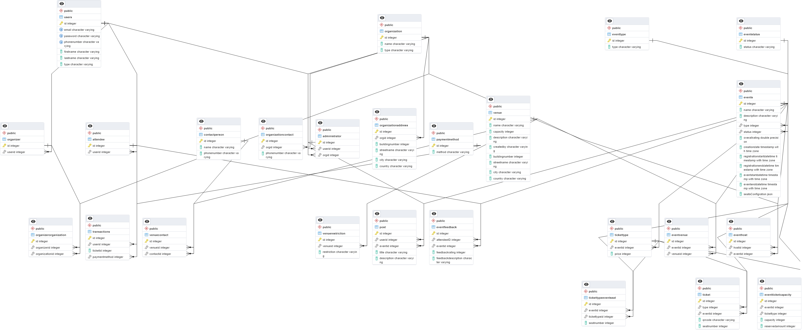

# Database Design

For the design of the database, requirements about the application were first gathererd and then compiled into business rules which were then used to create the ER diagram. shown below:


-The ER diagram can be more closely examined:


-The business rules used to create the ER diagram can also be found [here](https://handsomely-tabletop-129.notion.site/DB-Business-Rules-4c6d91638f2948d2a5aa8d2503afe0a2).

triggers file can be executed using psql or pgAdmin.
 If you're using psql, you can run the following command:
 ```bash
psql -U username -d dbname -f path/to/trigger_file.sql
```